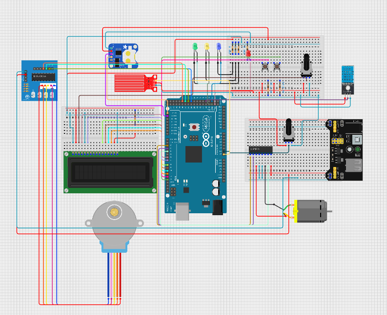

# Project Overwiew
The purpose of this project is implementing different components used in a water evaporation cooler using there respected registers and configurations. 

## Protocol/Registers Used
* UART
* ADC
* GPIO

## Components to implement:

* Temperature, humidity, and water level monitoring
* Main fan control
* Output vent adjustments
* User control (Start/Stop, Reset, Vent Control)
* Status LED output(s)
* Serial data communication (timestamped event reporting)

# Hardware
The microcontroller used in this project is the Arduino mega 2560 alongside sensors and other devices

## Components used:
* Arduino mega 2560
* 16-pin LCD Display
* DS3231 RTC Module
* 28BYJ-48 5v DC Stepper Motor (w/ control board)
* 5v DC Motor (w/ fan blade)
* DHT11 Sensor
* Water Level Sensor
* 3x Axial Push Buttons
* 4x LEDs (Green, Yellow, Red, and Blue)
* 10k Potentiometer
* 1x 220 Ohm Resistor
* 4x 330 Ohm Resistors
* 3x 1K Ohm Resistors
* 5v Powersupply
* 2x Breadboards (Large and Small sized)
* Jumper Wires

# Schematic

# Operation Procedure
The water evaporation cooler has 4 states, each with different components being monitor/used. 

## DISABLED State
In this state many of the main components are disabled. This state is indicated by a YELLOW status LED and the (DISABLED) message is displayed to the LCD. 

### Main components that are affected:

* Temperature, humidity, and water-level monitoring is disabled.
* The fan motor is turned OFF.

System will exit this state when the Start/Stop button is pressed, which will toggle to IDLE/RUNNING state if not in that current state.

## IDLE State
In this state most but not all main functions are enabled. This state is indicated by a GREEN status LED and the IDLE message is displayed to the LCD.

### Main components that are affected:
* Temperature, humidity, and water-level monitoring is enabled and readings are outputted to the LCD.
* The fan motor is turned OFF.

### System can exit this state in several ways:
* Exits upon toggle of the Start/Stop button (enters DISABLED state)
* Exits upon temperature falling outside of the set threshold level (enters RUNNING state)
* Exits when the water-level is lower then the set threshold level (enters ERROR state)

## RUNNING State
In this state all functions are enabled. This state is indicated by a BLUE status LED and the RUNNING message is displayed to the LCD.

### Main components that are affected:
* Indicated by a BLUE status LED and the RUNNING message displayed to the LCD.
* Temperature, humidity, and water-level monitoring is enabled and output to the LCD.
* The fan motor is turned ON.

### System can exit this state in several ways:
* Exits upon toggle of the Start/Stop button (enters DISABLED state)
* Exits when the temperature set threshold is satisfied (enters IDLE state)
* Exits when the water-level is lower then the set threshold level (enters ERROR state)

## ERROR State
In this state most functions are disabled. This state is indicated by a RED status LED and the ERROR message displayed to the LCD.

### Main components that are affected:
* Temperature, humidity, and water-level monitoring is disabled.
* The fan motor is turned OFF.
* An error message is displayed to the LCD.

### System can exit this state in several ways:
* Exits upon toggle of the Start/Stop button (enters DISABLED state)
* Exits upon press of the Reset button if water-level threshold is satisfied (enters IDLE state)

## Demonstration Video of States

visit the [demo of the states](https://youtu.be/uywrXzvMU14) on youtube!
